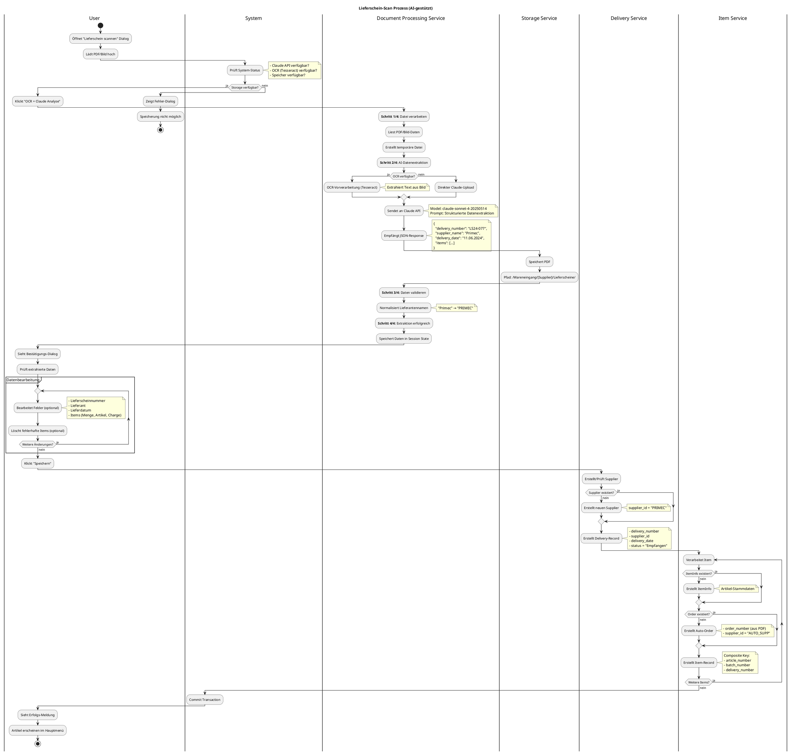

# UML Aktivitätsdiagramm: Lieferschein-Scan Prozess

## Prozessbeschreibung
Dieser Ablauf zeigt, wie ein Lieferschein gescannt, mit AI ausgewertet und in die Datenbank gespeichert wird.

---

## PlantUML Code

---

## Beteiligte Komponenten

### **Presentation Layer**
- `delivery_scan.py::show_delivery_scan_popup()` - Upload-Dialog
- `delivery_scan.py::process_uploaded_delivery_file()` - Dateiverarbeitung
- `delivery_scan.py::show_extraction_confirmation_popup()` - Bestätigung

### **Application Layer**
- `document_processing_service.py::process_document()` - Dokumenten-Verarbeitung
- `claude_api_client.py::extract_delivery_data()` - AI-Extraktion
- `delivery_service.py::create_delivery_from_extraction()` - Delivery-Erstellung
- `item_service.py::create_item()` - Item-Erstellung
- `supplier_service.py::create_supplier()` - Supplier-Erstellung

### **Infrastructure Layer**
- `document_storage_service.py::save_delivery_slip()` - PDF-Speicherung
- `path_resolver.py::resolve_delivery_slip_path()` - Pfad-Auflösung
- PostgreSQL Datenbank

---

## Wichtige Entscheidungspunkte

1. **Storage Check**: Verhindert Upload, wenn kein Speicher verfügbar
2. **OCR Verfügbarkeit**: Nutzt Tesseract wenn verfügbar, sonst direkter Claude-Upload
3. **Supplier-Existenz**: Erstellt automatisch neuen Supplier wenn nicht vorhanden
4. **Order-Existenz**: Erstellt Auto-Order mit "AUTO_SUPP" Supplier
5. **ItemInfo-Existenz**: Erstellt Stammdaten nur für neue Artikel

---

## Fehlerbehandlung

- **API-Key fehlt**: Prozess kann nicht starten
- **Storage nicht verfügbar**: Upload wird abgebrochen
- **Claude API Fehler**: Fehlermeldung mit Details
- **Datenbank-Fehler**: Rollback, Items werden einzeln verarbeitet (Fehler isoliert)

---

## Performance

- **Typische Dauer**: 3-10 Sekunden (abhängig von Claude API)
- **Parallel-Verarbeitung**: Nein (sequenziell)
- **Caching**: Ja (Document Cache für wiederholte Requests)
